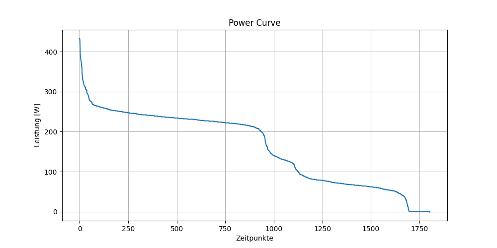

# Aufgabe-Leistungskurve
**Teilnehmende:** Melanie Pfusterer, Lisa Raffler, Vanessa Reich

Das Projekt lädt Daten aus einer **activity.csv** und **load_data.py** Datei, **sortiert** diese und erstellt daraus eine **power curve**

Zur Installation des Projekts wird pip verwendet.

## Dabei wird folgendermaßen vorgegangen:
1. Erstellen einer virtuellen Umgebung
    **->** python -m venv .venv
2. Aktivierung der virtuellen Umgebung
    **->** .venv\Scripts\activate
3. Installation der Abhängigkeiten
    **->** pip install -r requirements.txt
4. Nun kann das Projekt gestartet werden
    **->** python power_curve.py

## Was macht das Projekt?
1. Messdaten werden aus activity.csv geladen
2. Werte werden absteigend sortiert (Bubble sort)
3. Power curve wird erstellt
4. Graphik wird angezeigt und unter figures/power_curve.png gespeichert

## Die folgende Abbildung zeigt die erzeugte Power curve:

## Voraussetzungen für das Projekt:
- Python 3.10+
- numpy
- matplotlib
- pip